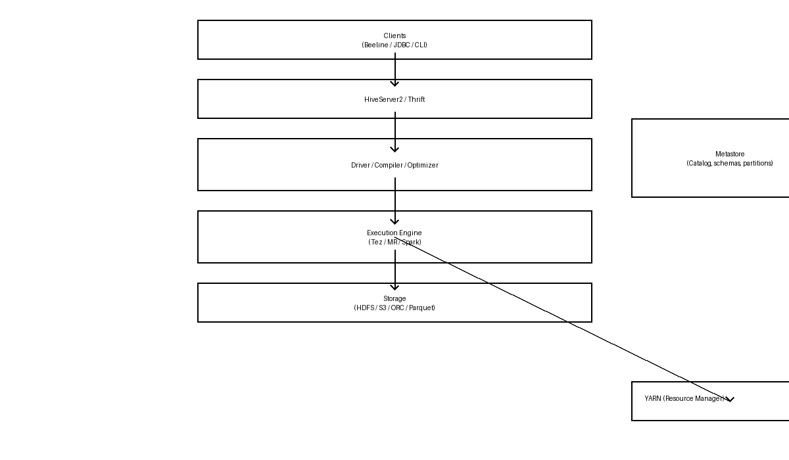

# Hive Architecture — Visual Cheat Sheet



## Quick overview
- Hive provides a SQL-like interface on top of Hadoop storage and execution. Key components: **Clients**, **HiveServer2**, **Driver/Compiler**, **Metastore**, **Execution Engine** (Tez / MR / Spark), **Storage** (HDFS / S3), and **YARN**.

## Layered ASCII diagram

Client Layer
  [Beeline / CLI / JDBC/ODBC clients]
            |
            v
  [HiveServer2 / Thrift Server]
            |
            v
  [Driver / Compiler / Optimizer]
            |
            v
  [Execution Engine (Tez / MR / Spark)] ---> [YARN]
            |
            v
  [Storage: HDFS / S3 / ORC / Parquet]

Metastore (central metadata)
  - Stores table schemas, partitions, SerDe info, locations
  - Consulted by Driver/Compiler and HiveServer2

## Mermaid flow (if your viewer supports it)

```mermaid
graph TB
  subgraph Clients
    C1[Beeline / CLI / JDBC/ODBC]
  end
  HS[HiveServer2]
  D[Driver / Compiler]
  MS[Metastore]
  OPT[Query Optimizer]
  EE[Execution Engine (Tez / MR / Spark)]
  Y[YARN]
  S[Storage (HDFS / S3 / ORC / Parquet)]

  C1 --> HS --> D --> OPT --> EE --> S
  EE --> Y
  D --> MS
  HS --> MS
```

## Mnemonic to remember the flow: "SOME HD"
- S: Storage (HDFS/S3)
- O: Optimizer (query planner & SQL -> physical)
- M: Metastore (metadata store)
- E: Execution Engine (Tez / MR / Spark)
- H: HiveServer2 / Driver (handles clients)
- D: Driver (compiler + interacts with metastore)

Tip: read it as "Hive: H (client/driver) asks M (metastore) then O (optimizer) sends to E (engine) which uses S (storage) via YARN" — shorter: H -> M -> O -> E -> S

## Short component notes
- HiveServer2: accepts client connections (Beeline/JDBC), forwards queries to Driver.
- Driver / Compiler: parses SQL, consults Metastore for schemas/partitions, creates execution plan.
- Metastore: central metadata service (often backed by a relational DB). Critical for table/partition information.
- Optimizer: applies rule-based and cost-based transformations (joins, predicate pushdown, partition pruning).
- Execution Engine: runs the physical plan (Tez by default for modern Hive; can be MR or Spark). Communicates with YARN for resources.
- Storage: data files (ORC/Parquet/Avro/text) stored in HDFS or object stores like S3.
- SerDe: serializers/deserializers that map file formats to Hive columns.
- Partitions & Buckets: help pruning and faster scans; stored as directories/metadata.

## Memory aid (one-liner)
"Hive = SQL front-end + Metastore brain + Execution engine muscles + HDFS skeleton"

---
Created for quick study and interview prep. Open this file: [Hive/hive_architecture_with_image.md](Hive/hive_architecture_with_image.md)
